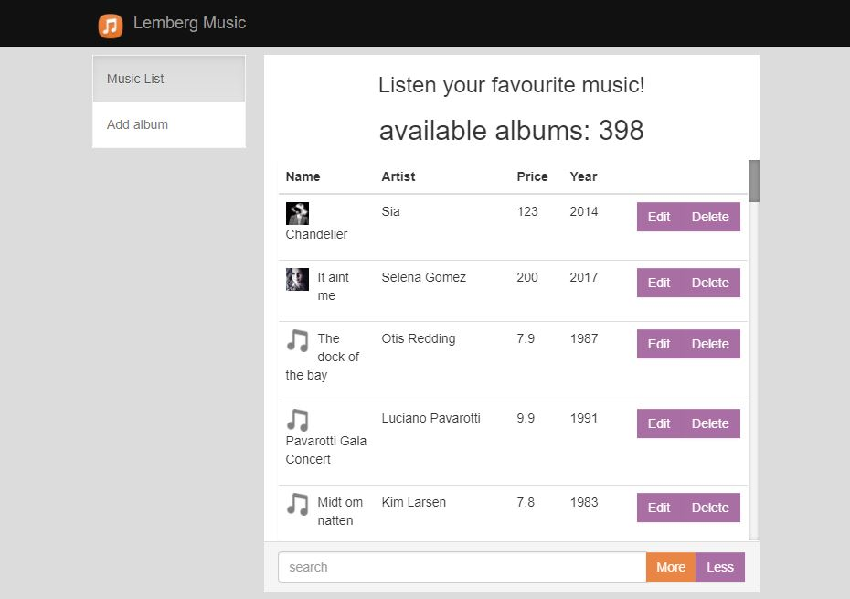

# FrontEnd developer Test
## Dima Kush notes 
### sub tasks planning:
- 15.08.17 - creating html layout, routing and directives
- 16.08.17 - 17.08.17 creating operating angular function(add, edit show, delete)
- modify Gruntfile.js, add minify css/js (and probably merge)
- work with Karma and Jasmine
- Release 

### Program specification:
- Controllers/models. In this app we are using model hierarchy based on scopes.
  Every model are incapsulated into anonymous function due to hide objects for overwriting.
- There is a main model with its's mainControler which inherit other sub models(mainList, albumDetail,     albumAddEdit, albumDelete) and their controllers.
- They, in turn, inherited from model "songShop", which also inherit directives and route services
- REST API was implemented with library ngResource
- some function was implemented with underCore lib
- using ui-router instead standart angularJs router

ScreenShots(17.08.17):
### Main page:

### Detail info (mobile version):

### Delete album (extra small mobile version):

